# Informe de git y GITHUB
### Descarga e instalacion de git

Para descargar git primero debemos entrar a la pagina oficial de GIT:


[https://git-scm.com/](https://git-scm.com/)


Le daremos en la pantalla azul que dice "Download for Windows"

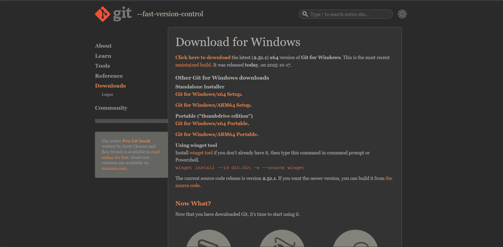

En este lugar daremos donde dicje Click Here to download y ya empezara la descarga del instalador de GIT.

Abrimos el instalador y aparecera lo siguiente:

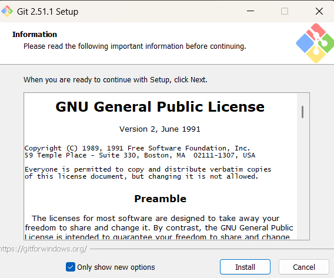

Seleccionaremos install y esperaremos a que se instale GIT en nuestra computadora.

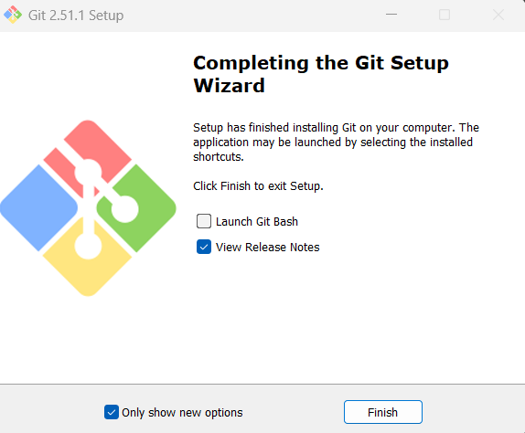

Asi se veria cuando termine la instalacion, le daremos fisnish

## COnfiguracion de GIT en mi equipo

Para empezar a configurar GIT tenemos que entrar a la cosnola y tenemos que saber movernos por ella entonces dejare una lista de los comandos mas basicos para empezar a usar la consola.

``ls``


Con este comando puedes ver los archivos y carpetas qie hay en donde estes ubicados.

``cd``

Con este comando puedes moverte por las carpetas que se ven cuando usas el comando ``ls`` por ejemplo si quiero ir al escritorio debo usar el siguiente comando:

``cd desktop``


Ahora que estamos en el escritorio crearemos una carpeta donde vamos a colocar nuestro proyecto, para crear la carpeta se usa el siguiente comando:

``mkdir "(nombre de la carpeta)"``

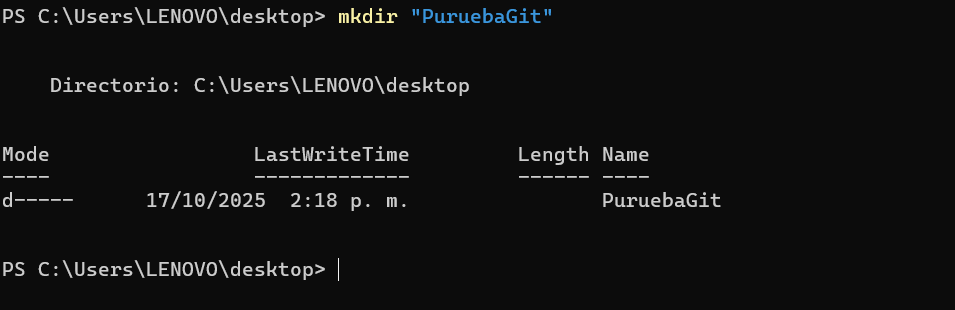

luego para ingresar a la carpeta se usa ``cd``


Ahora ya solo quedaria configurar el GIT para empezar a utilizarlo.

La primera configuracion sera para colocar usuario en el git.

``git config --global user.name "(nombre de usuario)"``

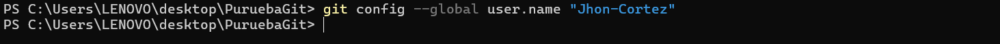

Luego se coloca tambien el correo

``git config --global user.email "(correo electronico)"``

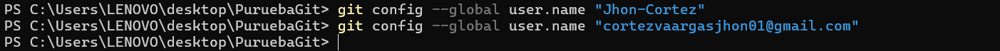

Con esta configuracion inicial ya podemos empezar a usar git.

## Comandos basicos de git

Como ya tenemos una carpeta donde vamos a trabajar con git desde la consola entonces vamos a colocar el siguiente comando para iniciar git en esa carpeta:

``git init``

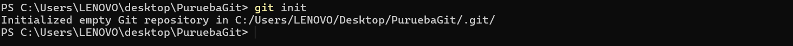

Ahi se puede ver que se inicializo un repositorio GIT vacio en esa carpeta

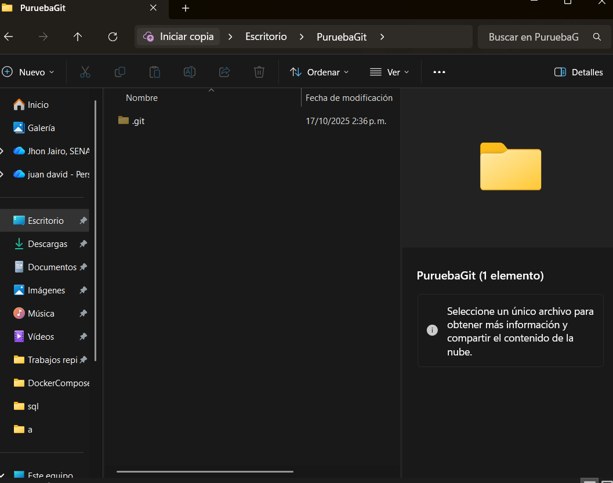

En el administrador de archivos de wondows nos mostrara una carpeta nueva que esta como archivo oculto.

Ahora usaremos el siguiente comando para saber que esta pasando en la carpeta:

``git status``

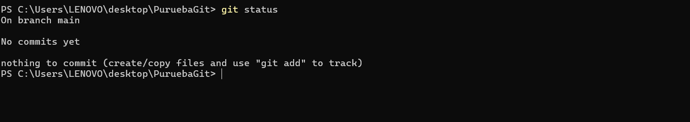

En este caso nos dice que la carpeta no tiene nada y que no hya tampoco nada preparado para subir, entonces creare un archivo de texto como ejemplo para usar los comandos de GIT.

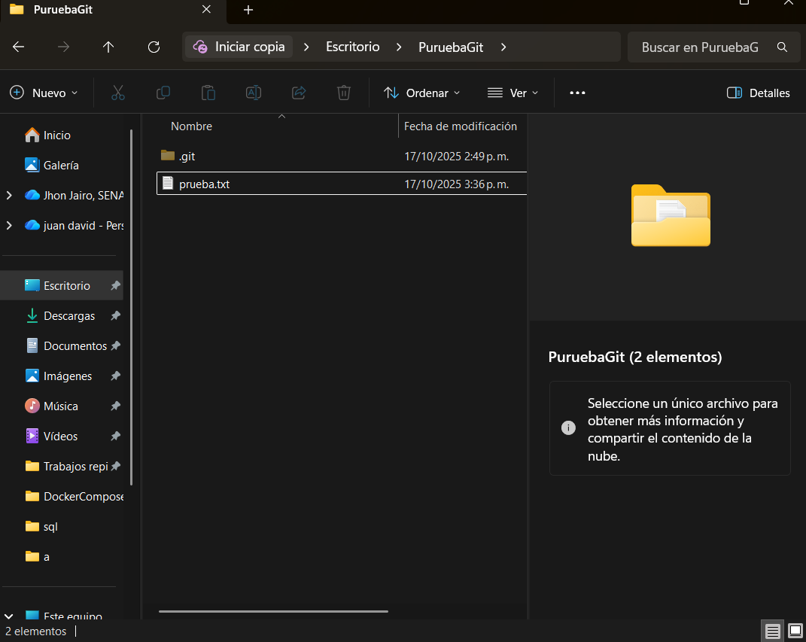

Ya se puede ver el nuevo archivo si usamos el comando ``git status``

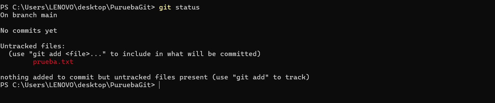

pero sigue sin estar preparado para subirse.


Para querer guardarlos toca añadirlos o prepararlos usando el siguiente comando:

``git add (archivo que se quiere cargar)``

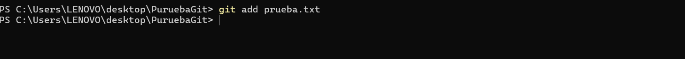

Ahora si usamos ``git status`` ya se vera que tenemos cargado y listo el archivo para subirlo


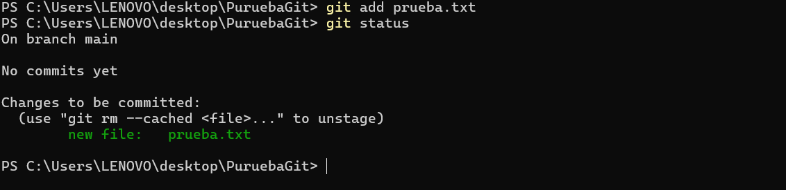

Aca se puede ver claramente que el archivo prueba.txt ya esta listo para subirlo. Para terminar de subirlo se usa el siguiente comando:

``git commit -m "(comentario de ese archivo o fichero)"``

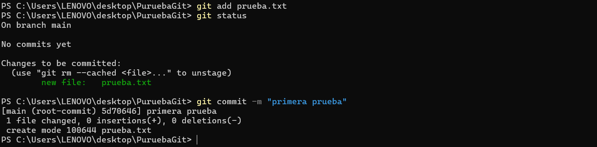

Ahora para saber el registro de los datos que he añadido al git solamente de bemos escribir el comand:

``git log``

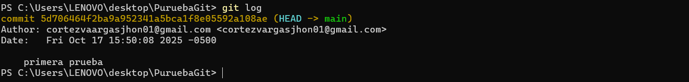

Esto no se hubiera podido hacer sin antes haber echo la configuracion de l git ya que como se puede ver muestra el autor. Con este comando nos muestra a trabes del tiempo los cambios o añadidos que se le han echo al proyecto.

A continuacion se hara una prueba modificando el archvo prueba.txt:

Escribiremos algo dentro del archivo prueba.txt

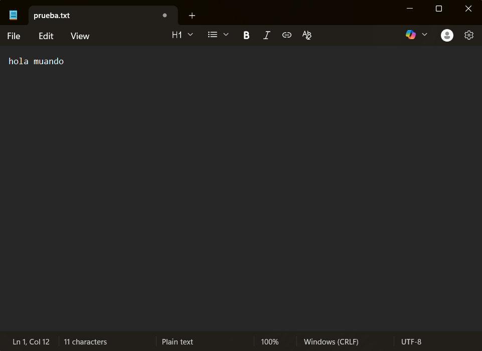

y guardaremos y enceguida colocaremos en la consola el comando ``git status``

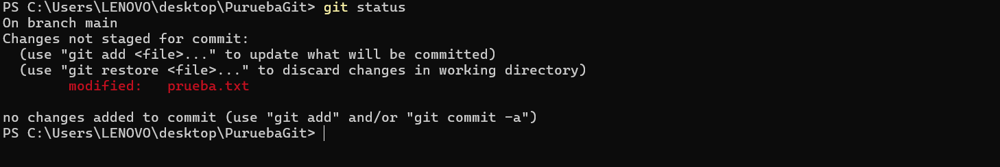

Se puede ver que en la consola nos muestra de que el archivo prueba.txt ha sido modificado entonces tenemos que volver a hacer el proceso para preparar y subir a git los nuevos cambios, primero usando el comando ``git add`` y luego usando ``git commit -m ("mensaje del cambio que se hizo")``:

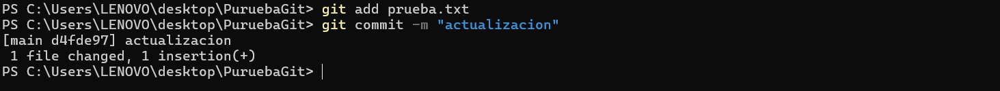

Para poder evindeciar las versiones de este archivo deberemos colocar el comando ```git log`` para que nos muestre la fecha y hora de cuando se subio la actualizacion:

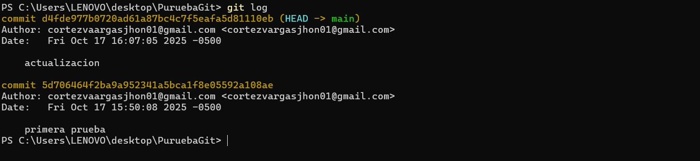

Se puede ver que la primera version de este archivo fue a las 3:20 pm y la siguiente fue a las 4:07 pm y con el mensaje de que fue una actualizacion.

Tambien en caso tal de que queramos volver a la version anterior se puede hacer facilmente usando el siguiente comando:

``git checkout (nombre dek archivo que se quiere devolver la actualizacion)``

Con este comando podemos volver una version en este caso la de nuestro archivo pruab.txt

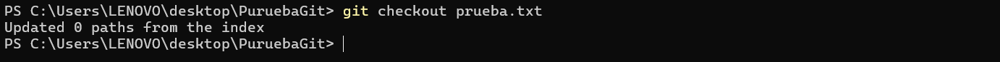


Ahora revisamos el archivo y vuelve a estar como estaba en la primera sbuida

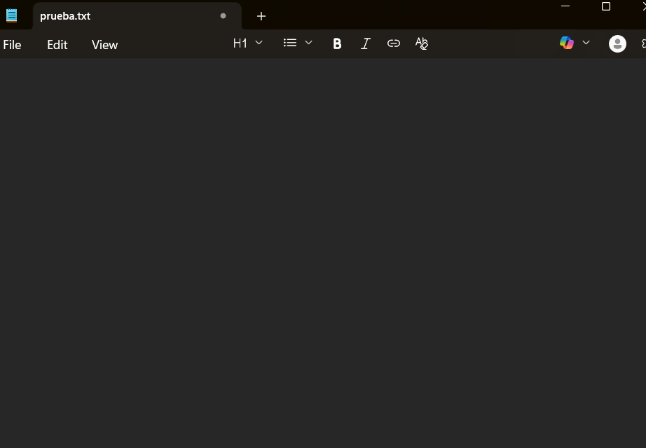


